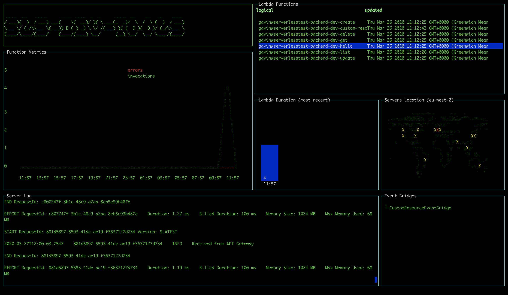

# sls-dev-tools
The Dev Tools for the Serverless World

⚠ Still in early POC stages, stable Alpha release expected in next weeks. ⚠



[Full docs here.](https://theodo-uk.github.io/sls-dev-tools/docs/README)
[Learn more...](https://theodo-uk.github.io/sls-dev-tools)

# To Run

- Run `yarn dev`
- Then `yarn start -n {YOUR_STACK_NAME} -r {YOUR_REGION} [-t {START_TIME}]`
- If this doesn't work, have a look on AWS and see what your stack is called as it may be a different name than you expect, e.g. with `-dev` on the end
- Try to choose a function with the arrow keys and enter to see the metrics. You may get an `AccessDenied` error in which case you must add the `GetMetricData` permission from CloudWatch in the IAM console on AWS.

```
Options:
  -V, --version                 output the version number
  -n, --stack-name <stackName>  AWS stack name
  -r, --region <region>         AWS region
  -t, --start-time <startTime>  when to start from
  -p, --period <period>         precision of graphs, in seconds
  -h, --help                    output usage information
```

# Build

- `yarn build`

# A note on AWS API calls and pricing

This tool does make use of the AWS API to get metrics. Authentication is handled implicitly via the AWS NodeJS SDK. Pricing around Cloudwatch is designed for scale, but be warned that this tool is making calls to AWS.

Full details on AWS API pricing can be found here:
- https://aws.amazon.com/cloudwatch/pricing/

For instance, the cost of GetMetricData as of 25/08/19 was $0.01 per 1,000 metrics requested.
- This tool take no liability in pricing data provided and please use AWS's docs to ensure pricing is appropriate for you.

The current list of calls made by the tool:

- CloudFormation: listStackResources
- CloudWatch: getMetricData
- More may be added, check code for full list


# Libs

Heavily based off the amazing [blessed](https://github.com/chjj/blessed) and [blessed-contrib](https://github.com/yaronn/blessed-contrib) projects.

## Core Team

| [Ben Ellerby](https://github.com/BenEllerby) | [Abbie Howell](https://github.com/abbiehowell) | [Rob Cronin](https://github.com/robcronin) |
|---|---|---|
|  |  |  |
